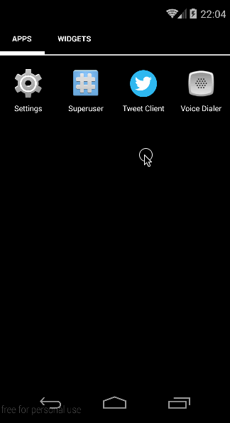

# Week 4 Project : Twitter Client

Build a simple Twitter client that supports viewing a Twitter timeline and composing a new tweet.
__Extend the Twitter client from previous project to use a tabbed interface and fragments.__

The project build based on the [RestClient](https://github.com/codepath/android-rest-client-template) template project

The API used :

- [Retrieve user twitter logged in user](https://dev.twitter.com/rest/reference/get/account/verify_credentials)
- [Retrieve home timeline](https://dev.twitter.com/rest/reference/get/statuses/home_timeline)
- [Compose new tweets](https://dev.twitter.com/rest/reference/post/statuses/update)
- [Mentions timeline](https://dev.twitter.com/rest/reference/get/statuses/mentions_timeline)
- [Re-tweet](https://dev.twitter.com/rest/reference/get/statuses/retweets/%3Aid)
- [Search](https://dev.twitter.com/rest/reference/get/search/tweets)

User story completed:

- [x] Includes all required user stories from Week 3 Twitter Client
- [x] User can switch between Timeline and Mention views using tabs
    
        - User can view their home timeline tweets.
        - User can view the recent mentions of their username.
    
- [x] User can navigate to view their own profile

        - User can see picture, tagline, # of followers, # of following, and tweets on their profile.

- [x] User can click on the profile image in any tweet to see another user's profile.

        - User can see picture, tagline, # of followers, # of following, and tweets of clicked user.
        - Profile view should include that user's timeline
        
- [x] User can infinitely paginate any of these timelines (home, mentions, user) by scrolling to the bottom
- [x] Error handling, check if internet is available, handle error cases, network failures

        - When network is unavailable, all data came from DB (it support all home, mentions, and search lookup on available cache/db)

- [x] When a network request is sent, user sees an indeterminate progress indicator 
- [x] User can click on a tweet to be taken to a "detail view" of that tweet

        - User can take __reweet__ actions on a tweet (in the video are shown on their profile page)
        
- [x] User can search for tweets matching a particular query and see results

